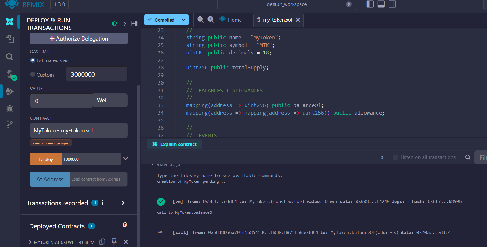
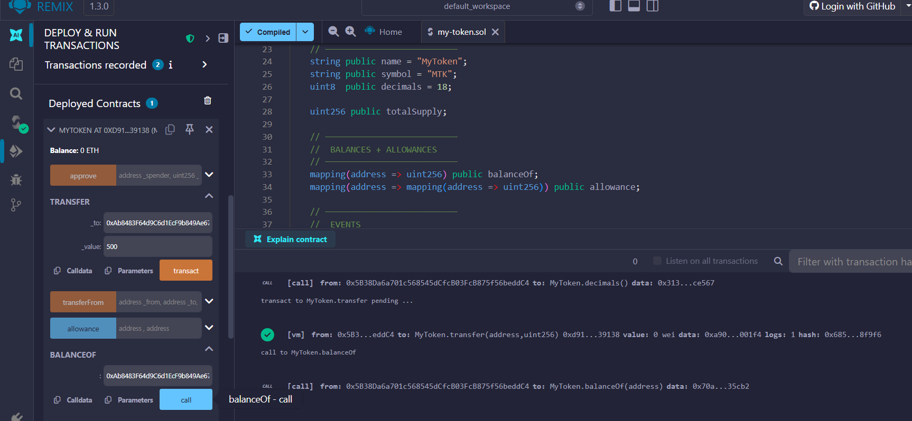
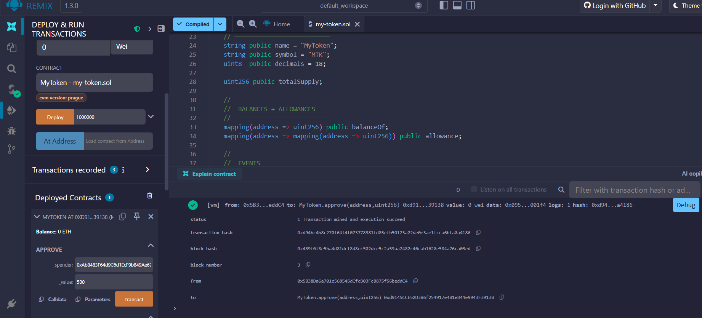

# MyToken – ERC-20 Token Project

This repository contains a custom ERC-20 token smart contract built using Solidity and deployed through the Remix IDE.
The token fully implements all required ERC-20 standards including transfers, allowances, approvals, and event logging.

---

## 📌 Token Details

| Property | Value |
|--------|--------|
| **Token Name** | MyToken |
| **Symbol** | MTK |
| **Decimals** | 18 |
| **Total Supply** | 1,000,000 (Raw Units for Testing) |
| **Contract Standard** | ERC-20 |

> **Note:** For testing purposes in Remix, inputs are handled in raw units (Wei). A value of `500` represents 500 smallest units of the token.

---

## 📖 What is an ERC-20 Token?

ERC-20 is the most common token standard on Ethereum.
It defines a set of functions that every compatible token must implement so that wallets, exchanges, and dApps can interact with it.

Your token includes all required standard functions:

✔ `transfer()`
✔ `transferFrom()`
✔ `approve()`
✔ `allowance()`
✔ `balanceOf()`
✔ `totalSupply()`

---

## ✨ Features Implemented

| Feature | Status |
|---|---|
| ERC-20 Standard Token | ✓ |
| Tokens Minted to Owner on Deployment | ✓ |
| transfer() – Send tokens to any address | ✓ |
| approve() – Allow others to spend your tokens | ✓ |
| transferFrom() – Delegated spending | ✓ |
| balanceOf(), allowance() views | ✓ |
| Transfer + Approval events emitted | ✓ |
| Validation checks (balance + allowance) | ✓ |

---

## 🛠 Deployment Instructions (Remix IDE)

1. Open [Remix IDE](https://remix.ethereum.org).
2. Create file → **contracts/MyToken.sol**.
3. Paste the smart contract code.
4. Select Solidity **0.8.x** compiler → Compile.
5. Go to **Deploy & Run** tab.
6. Enter initial supply (e.g., `1000000`).
7. Click **Deploy**.
8. Contract will appear under *Deployed Contracts*.

---

## 🔥 Usage Examples

| Action | Example |
|---|---|
| Check total supply | `totalSupply()` |
| Check balance | `balanceOf(address)` |
| Transfer tokens | `transfer(to, amount)` |
| Approve spender | `approve(spender, amount)` |
| Spend approved tokens | `transferFrom(owner, receiver, amount)` |
| Check allowance | `allowance(owner, spender)` |

---

## 🧪 Testing Performed

| Test | Result |
|---|---|
| Compilation successful | ✔ |
| Contract deployed on Remix | ✔ |
| Token balance verified | ✔ |
| transfer() executed | ✔ |
| approve() executed | ✔ |
| **Error Handling:** transferFrom without allowance | ✔ (Reverted as expected) |
| transferFrom executed after approval | ✔ |

---

## 📸 Screenshots

| Category | Screenshot |
|---|---|
| **1. Deployment** |  |
| **2. Token Info** |  |
| **3. Transfer & Approve** |  |
| **4. Event Logs** |  |

---

## 🧠 What I Learned

- **ERC-20 Architecture:** How the standard interfaces work internally.
- **Delegated Transfers:** How `approve` and `allowance` work together to secure `transferFrom`.
- **Error Handling:** Understanding EVM reverts (e.g., "Allowance too low").
- **Remix Workflow:** Deploying, interacting, and debugging contracts using the Remix VM.
- **Interoperability:** Why following standards is essential for dApp integration.

---

## 📂 Repository Structure

```text
my-token/
├── contracts/
│   └── MyToken.sol
├── screenshots/
│   ├── deployment.png       (was 01_deploy_success.png)
│   ├── token-info.png       (was 02_balance_owner.png)
│   ├── transfer-test.png    (was 03_approve_tx.png)
│   └── events.png
└── README.md
